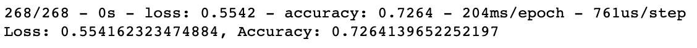
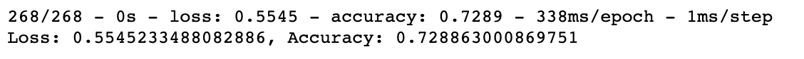

# Neural_Network_Charity_Analysis

## Overviews of Analysis
a philanthropic foundation is seeking to know the impact of each of the foundations donations as well as vet potential donation recipients to ensure the donation will be used effectively.

### Purpose
The purpose of this project is to build a neural network and create a binary classifier that will predict if an applicant will be successful if funded by Alphabet Soup foundation, or if the applicant is too high risk.

## Results
### Data Processing 
- The target variable used for this model is 'IS_SUCCESSFUL'.
- The features included in this model are: 'APPLICATION_TYPE', 'AFFILIATION', 'CLASSIFICATION', 'USE_CASE", 'ORGANIZATION', 'STATUS', 'INCOME_AMOUNT', 'SPECIAL_CONSIDERATION', and 'ASK_AMOUNT'.
- The columns 'NAME' and 'EIN' were drop as they contain non-beneficial id information. These columns were neither targets or features.

### Compiling, Training, and Evaluating the Model
- In the initial neural network model, I used two hidden layers with 88 and 44 neurons respectively. 
- Target model performance was not achieved as the model was never able to reach 75% accuracy.
- In efforts to optimize the model and achieve target performance the first step taken was to decrease the size of the 'other' bins. The next optimization attempt was to add a third hidden layer. Epochs were increased to 100. Changing the activation function of the third hidden layer was also tried in order to improve model performance.

**ORIGINAL MODEL**

**OPTIMIZED MODEL**

## Summary
Despite many attempts to optimize this machine learning model, I was unable to reach the target performance of 75% accuracy. The highest accuracy achieved by the optimized model was slightly under 73% which is no different for the original machine learning model that was created. I would recommend using a logistic regression supervised machine learning model as an alternative. I recommend this because logistic regression is used for predicting binary outcomes; in this case predicting whether an applicant will be or will not be successful if they are to receive a donation.  
